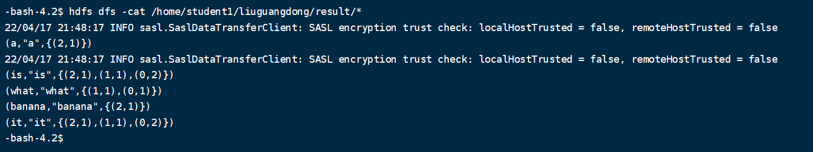
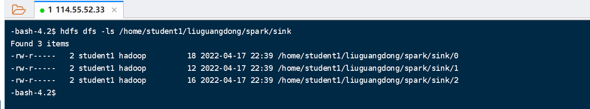

#geek bigdata homework

# week05
```shell
!connect jdbc:hive2://localhost:10000/liuguangdong
```
## topic 2
```shell
 http://localhost:9091/hive/topic2?numOfRate=50\&numOfMovie=10
```
## topic 3
```shell
curl http://localhost:9091/hive/topic3?sex=F\&numOfMovie=10
```

# week06

## 命令
```shell
spark-submit --class invertedindex.InvertedIndex --master yarn --deploy-mode cluster week06-1.0-SNAPSHOT.jar /home/student1/liuguangdong/spark /home/student1/liuguangdong/result
```
##结果


## 题目二

```shell
spark-submit --class distcp.SparkDistCP --master yarn --deploy-mode cluster week06-1.0-SNAPSHOT.jar /home/student1/liuguangdong/spark/source /home/student1/liuguangdong/spark/sink 10 false
```

##结果


