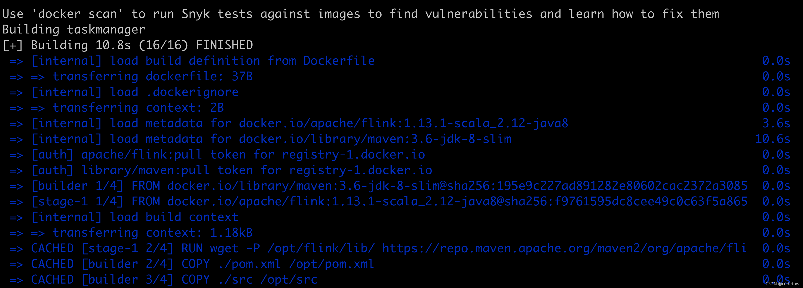
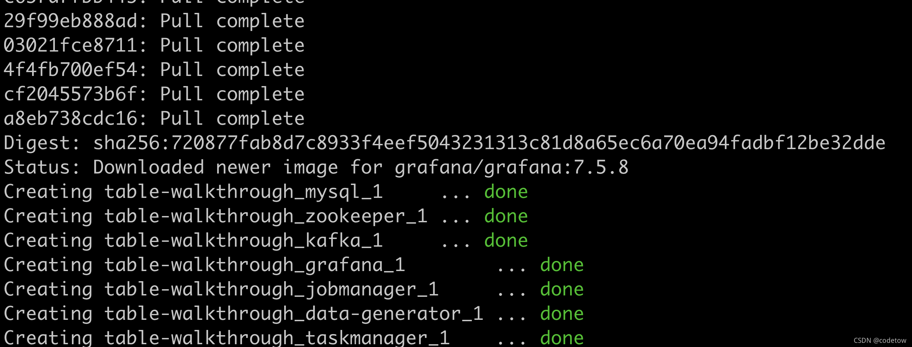
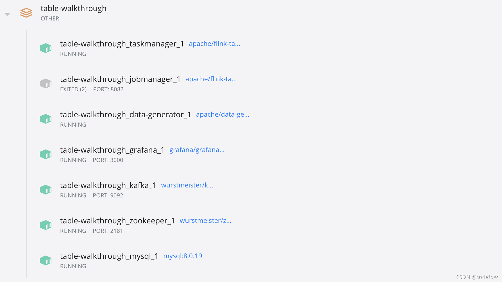
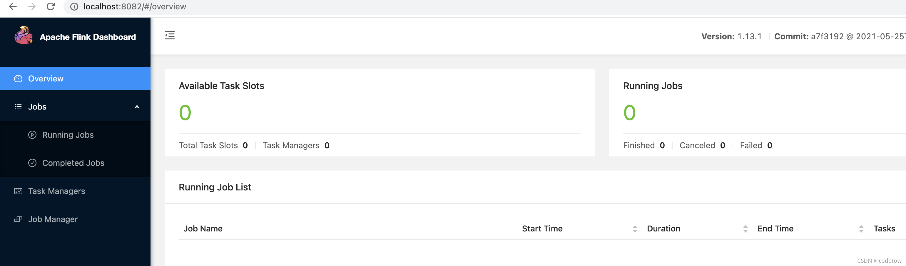
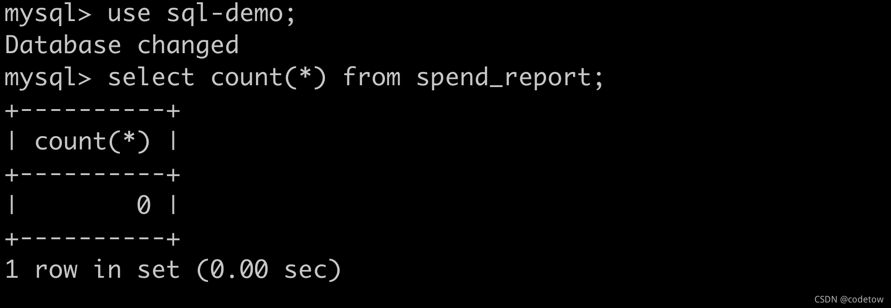
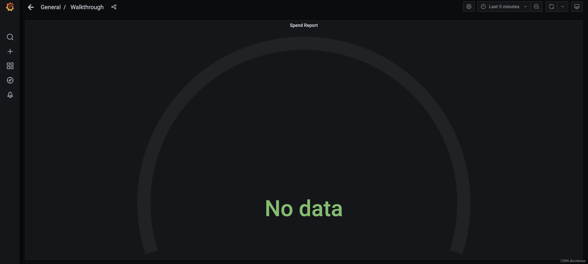
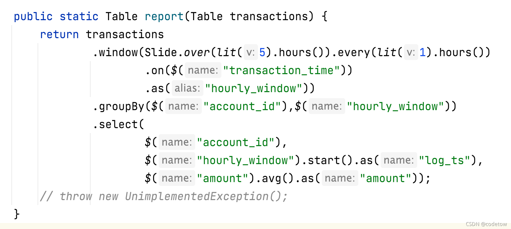

report(transactions).executeInsert(“spend_report”);
将transactions表经过report函数处理后写入到spend_report表

每分钟(小时)计算在五分钟(小时)内每个账号的平均交易金额(滑动窗口)？
注：使用分钟还是小时作为单位均可

一、代码环境
配置文件位于flink-playgrounds仓库中，首先拉取该仓库并构建 Docker 镜像

```shell
git clone https://github.com/apache/flink-playgrounds.git
cd flink-playgrounds/table-walkthrough
```

二、如何运行和停止
在开始运行之前先在Docker主机上创建检查点和保存点目录（如果不做这一步有可能报错）

```shell
mkdir -p /tmp/flink-checkpoints-directory
mkdir -p /tmp/flink-savepoints-directory
```

编译打包代码（本地打开Docker后，在flink-playgrounds/table-walkthrough目录下执行）

docker-compose build

启动环境

```shell
docker-compose up -d
```


手动开启端口（不知道为什么没开）




执行如下命令停止 Docker 环境

```shell
docker-compose down -v
```
验证


代码

